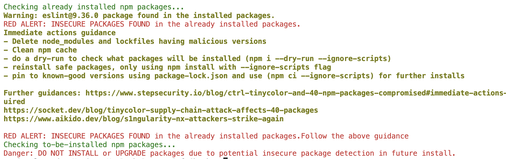

# npm safe check

This repository provides a script to check for known malicious npm packages (eg: related to the **Shai-Hulud** supply chain attack) before installing or upgrading dependencies. It also detects if any compromised packages are already installed in your project. It helps mitigate the risk of supply chain attacks by verifying package versions against a list of compromised packages identified as of 20th Sept 2025.

## Usage

1. Clone this repository or download the `npmSafeCheck.sh` script and `npmMalwareChecklist.json` file.
2. Place the script and JSON file in your project root directory.
3. Run the script BEFORE executing `npm install` or `npm update`:
   ```bash
   sh npmSafeCheck.sh
   ```
   or you can run it as a npm script by adding the following to your `package.json`:
   ```json
    "scripts": {
        "safe-check": "sh npmSafeCheck.sh"
        }
   ```
4. If the script detects any known malicious packages, it will flag and provide guidance on mitigation steps.
   

5. You can also refer to a database of known compromised packages instead of the local JSON file.
6. An example of how to integrate this script into a CI/CD pipeline is provided in the `.github/workflows/ci.yml` file.

# Immediate actions guidance

If you have already installed or upgraded packages and suspect that your project may be affected by the Shai-Hulud attack, take the following immediate actions:

- Delete `node_modules` and lockfiles having malicious versions

```bash
rm -rf node_modules package-lock.json yarn.lock
```

- Clean npm cache

```bash
npm cache clean --force
```

- do a dry-run to check what packages will be installed , this will not run any install scripts but will show what packages will be installed

```bash
npm install --dry-run --ignore-scripts
```

- reinstall safe packages only using npm install with `--ignore-scripts` flag

```bash
npm install --ignore-scripts <safe-package>@<safe-version>
```

- pin to known-good versions using package-lock.json
  and use `npm ci` for future installs

```bash
npm ci --ignore-scripts
```

- Search for repos or worklows or branches with name **Shai-Hulud** in your public GitHub repositories and [indicators of compromise](https://www.stepsecurity.io/blog/ctrl-tinycolor-and-40-npm-packages-compromised#github-search-queries-for-detection), like bundle.js hash, suspicious network calls, function calls or process executions.

- Clean infected repositories('shai-hulud' branches and workflows). referenced from: https://www.stepsecurity.io/blog/ctrl-tinycolor-and-40-npm-packages-compromised#immediate-actions-required

```bash
# Check for and remove the backdoor workflow
rm -f .github/workflows/shai-hulud-workflow.yml

# Look for suspicious 'shai-hulud' branches in all repositories
git ls-remote --heads origin | grep shai-hulud

# Delete any malicious branches found
git push origin --delete shai-hulud

```

- Audit environments (CI/CD agents, developer laptops) that installed the affected versions for unauthorized publishes or credential theft.
- Rotate npm tokens and other exposed secrets if these packages were present on machines with publishing credentials.
- Turn on multifactor authentication on GitHub and npm.
- Audit Cloud Infrastructure for Compromise
- Monitor network logs for active exploitation.
- Monitor logs for unusual npm publish or package modification events.

Further guidance's and references: https://www.stepsecurity.io/blog/ctrl-tinycolor-and-40-npm-packages-compromised#immediate-actions-required
https://socket.dev/blog/tinycolor-supply-chain-attack-affects-40-packages
https://www.aikido.dev/blog/s1ngularity-nx-attackers-strike-again
